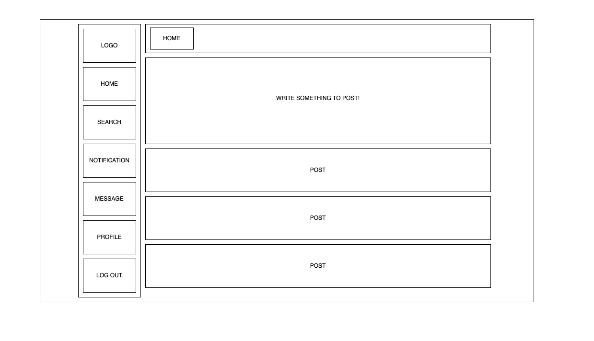
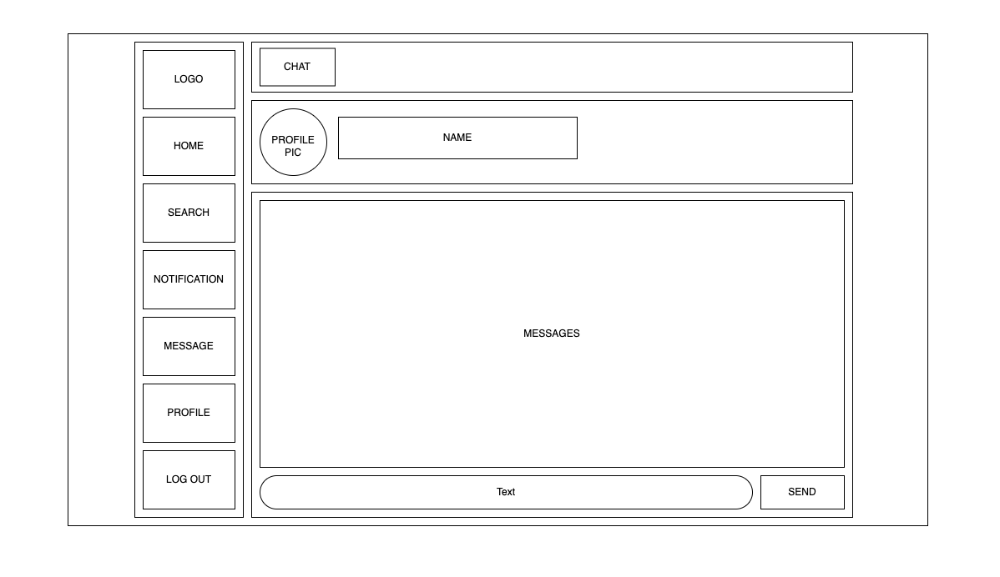
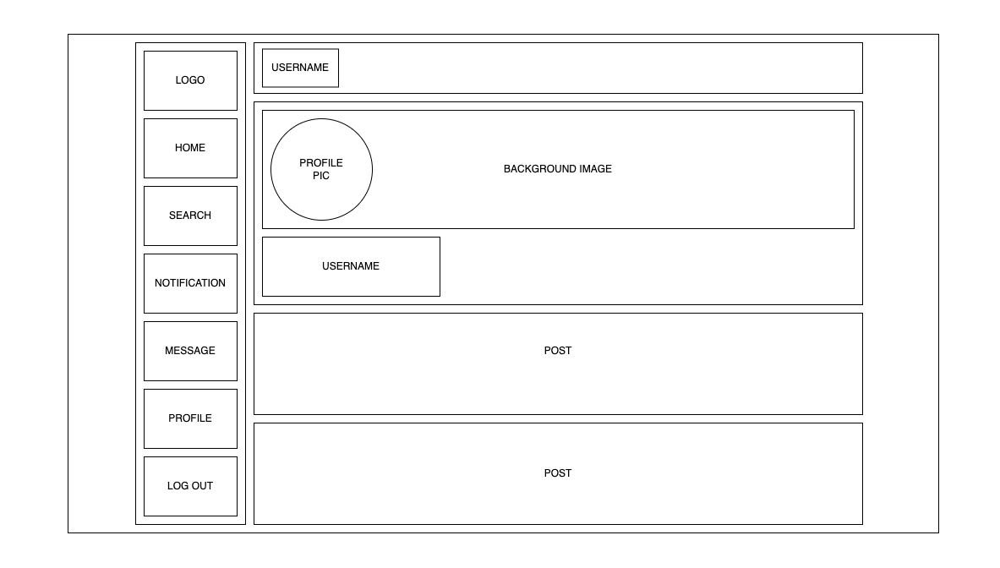
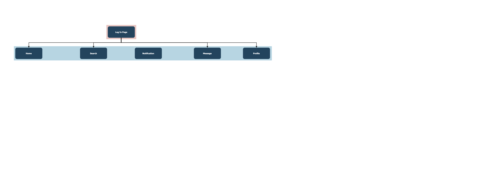

# Zwizzer

## Overview

Zwizzer is a web app that will allow users to post microblogs, chat with friend, like other users' posts... basically do same things on Twitter. Users can register and login. Once they're logged in, they can view their own posts or their friends' posts. They can add friends and delete friends.

## Data Model

The application will store Users, Posts, Messages, Chats.

* in future development, a user might has follower list by embedding

An Example User:

```javascript
{
  firstName: "Zander",
  lastName: "Chen",
  username: "zc1212",
  email: "someemail@gmail.com",
  password: "hashed password",
  profilePic: "/images/profilePic.png",
  coverPhoto: "aPuppy.png",
  likes: "post ref",
  retweets: "post ref",
  following: "user ref",
  followers: "user ref"
}
```

## [Link to Commented First Draft Schema](src/schemas/User.mjs) 

(See src/schemas/User.mjs)

## Wireframes

/home - home page of a user if logged in



/chat - page for showing direct message with another user



/profile - page for a user's profile



## Site map



## User Stories or Use Cases

1. as non-registered user, I can register a new account with Zwizzer
2. as a user, I can log in to Zwizzer
3. as a user, I can post a new blog
4. as a user, I can view other users' post
5. as a user, I can add friends
6. as a user, I can send direct messages
7. as a user, I can upload and change my profile picture

## Research Topics

* (5 points) Synchronous Chat
    * I'm going to use Socket.IO for synchronous chat between users
* (3 points) Pug
    * use Pug template engine to allow logics when rendering templates
* (2 points) cropper.js
    * use cropper.js to crop user's profile image and/or cover image
* (2 points) multer.js
    * use multer.js, a node.js middleware, to handle multipart/form-data when users try to upload their profile image/cover photo

## [Link to Initial Main Project File](src/app.mjs)

## Annotations / References Used

(__TODO__: will add to this later on if I use any)
